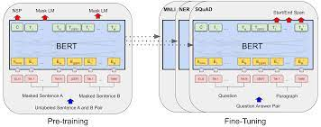
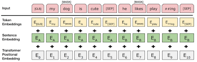

# Bert
<p dir="auto">Our implementation of paper:  <a target="_blank" href="https://arxiv.org/pdf/1810.04805.pdf" rel="nofollow">BERT: Pre-training of Deep Bidirectional Transformers for Language Understanding</a>, using <a target="_blank" href="https://www.tensorflow.org/" rel="nofollow">Tensorflow.</a></p>
<p align="center">
    
</p>

<p dir="auto">Bert Architecture :</p>
<p align="center" dir="auto">
    <a target="_blank" rel="noopener noreferrer" href="/images/bert_model.jpeg">
        
    </a>
</p>
<p dir="auto">Input embeddings :</p>
<p align="center" dir="auto">
    <a target="_blank" rel="noopener noreferrer" href="/images/input_embedding.png">
        
    </a>
</p>

Advisors, Reviewers:
- Github: https://github.com/bangoc123
- Email: protonxai@gmail.com

Reviewers:
- Github: https://github.com/NKNK-vn
- Email: khoi.nkn12@gmail.com

Authors:
- Github: https://github.com/SonMichael
- Email: lehuuson2014@gmail.com
- Github: https://github.com/dunghoang369
- Email: dung.hoang300699@gmail.com

## I.  Set up environment

- Step 1:
- Add 4gb ram for docker
- docker-compose build
- docker-compose up
- docker-compose exec bert bash
    + conda env create -f environment.yml
    + conda init bash
    + re-start docker-compose
    + conda config --set auto_activate_base false
- python name.py

- Option (can run when install conda success):
    + conda config --set auto_activate_base false (disable auto activate in bash)
    + conda env list (check env in conda)
    + conda activate bert
    + conda deactivate
    + conda create -n python_3.7 python=3.7 (create virtual env)
    + conda list (check libs in conda)
    + conda install beautifulsoup4 (install lib)
    + conda search beautifulsoup4 (search lib)
    + pip show pickle5 (show version of package)
    + pip list (show list version)
    + conda env update --file environment.yml --prune (--prune uninstalls dependencies which were removed from environment.yml)
    + conda env update --name bert --file environment.yml --prune
    + docker swarm init (if we want use swarm for docker)
    + docker stats --all (check status of containers)


## II. Training Process

<p dir="auto">Review training on colab:</p>
<p dir="auto">
<a target="_blank" href="https://colab.research.google.com/drive/1x75S9AUydJUPGS1_TTXHo21QhAhl-uHa?usp=sharing#scrollTo=I2Q9DzmwyDHM" rel="nofollow">
     
</a>
</p>
Training script:

```bash
python train.py --epochs ${epochs}
```

## III. Predict Process

```bash
python predict.py
```

## IV. Result

```
Checkpoint was saved at /checkpoints/ckpt-3
Epoch 200 Loss 0.5151
Epoch 201 Loss 0.5150
Epoch 202 Loss 0.5147
Epoch 203 Loss 0.5145
Epoch 204 Loss 0.5140
```
## V. Feedback
If you meet any issues when using this library, please let us know via the issues submission tab.